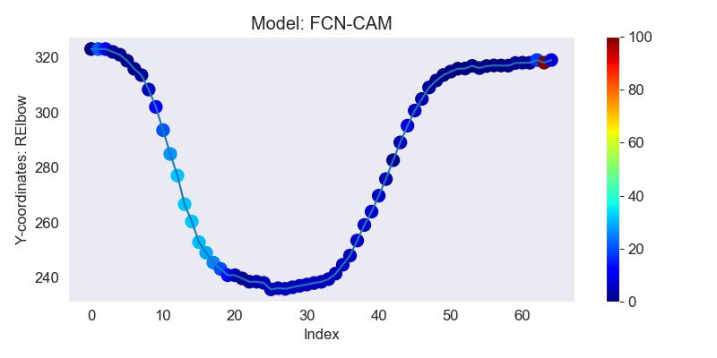
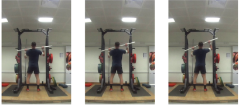

This repository contains code and data for the paper *"Interpretable Classification of Human Exercise Videos through Pose Estimation and Multivariate Time Series Analysis
"*. The paper presents an approach for the classification and interpretation
of human motion from video data. It applies state-of-the-art advances in
the area of Human Pose Estimation for video and Multivariate Time Series Classification
and Interpretation. The aim is to facilitate physiotherapists, coaches and rehabilitation
patients by providing feedback after the execution of physical exercises. 

The data used is the pre-recorded videos of Military Press. The first step consists of applying
OpenPose to extract the time series data from the video. The second step
classifies the extracted data using multivariate time series classification methods (MTSC). 
We chose deep learning methods FCN and Resnet for classification and KNN (with n=1) for benchmark. 
MTSC methods such as MrSEQL, FCN, Resnet also supports interpretation 
by highlighting the the discriminative region. We further compared the results with 
with the highly efficient ROCKET.

<em>**Fig 1** showing the overview of the proposed approach for the Military Press exercise. Going from raw video to
extracting and tracking body points using human pose estimation, and preparing the resulting data for
time series classification and interpretation.</em>

## Data Description
The data used are video recordings of the execution of the Military Press (MP) exercise.
Participants completed 10 repetitions of the normal form and 10 repetitions of induced forms. 
The data folder consist of the extracted time series data which is already splitted into training/testing using the 70/30 split.
The folder data/TrainTestData consists data in the numpy format whereas the folder data/TrainTestDataSktime consists data in sktime format.
The data is further resampled to have same length for all the samples.
There are roughly 1300 and 600 samples in training
and testing data respectively. Each data sample is a multivariate time series data with a
shape of 161x8 (161 length and 8 dimensions).

### Installation
Please use the requirements.txt file to install all the dependencies.

## Results
Classifier Name | Accuracy (Unnormalized data) | Accuracy (Normalized data)
--------------- | -----------------------------| ---------------
1NN-DTW | 0.58 | 0.50 
ROCKET | **0.81** | **0.68**
FCN | **0.72** | **0.65**
Resnet | **0.73** | **0.65**

Table showing average accuracy on test data over three train/test splits. Normalising the time series
significantly reduces the accuracy of all classifiers, due to losing information about the range and
magnitude of the signal capturing the exercise movement.

## Visualization
We further exploited the class activation mapping (CAM) to find the discriminative region.
The discriminative region is mapped back to the original frames in the video. Below figure
shows the discriminative region and the corresponding frames for
FCN. The frames are taken from regions marked with a red ellipse.

Figure showing the discriminative region (left) and the corresponding frames (right) for class A for FCN-CAM.
## Citation
Please cite this paper if it helps in your research.

* Interpretable Classification of Human Exercise Videos
through Pose Estimation and Multivariate Time Series Analysis.
Ashish Singh, Binh Thanh Le, Thach Le Nguyen, Darragh Whelan,
Martin O’Reilly, Brian Caulfield, Georgiana Ifrim

